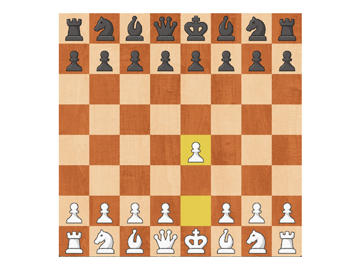

# Pygame Chess

Chess made in Pygame using OOP concepts.
(This is an older project that wasn't on GitHub)

## Features

- This project also supports asset downloader that downloads all assets from Chess.com and lets user choose playing set

